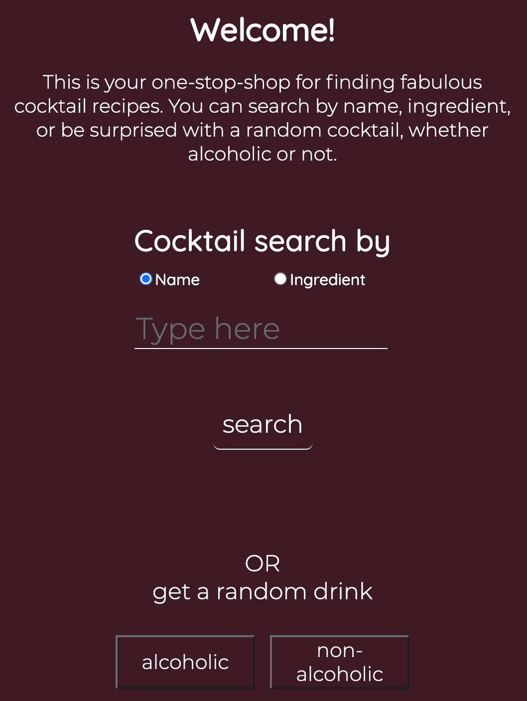
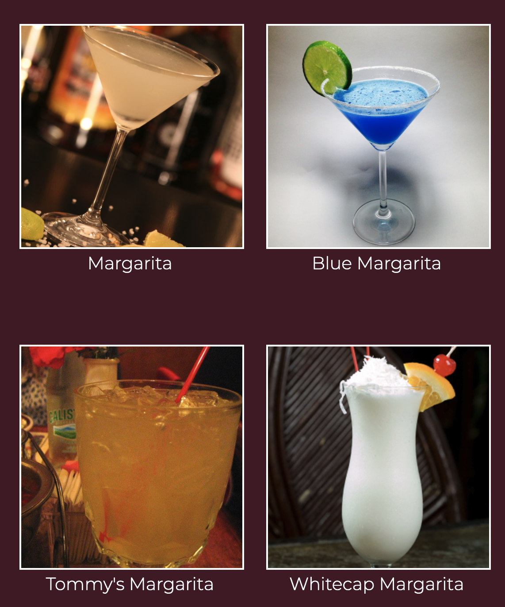
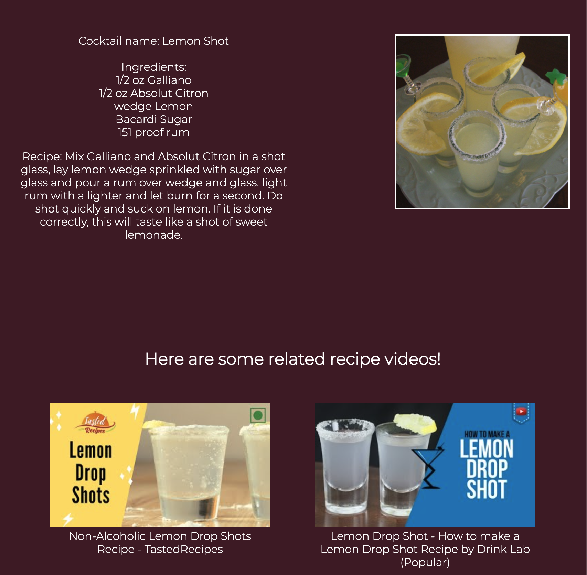

# Cocktail Recipes
User will be able to look up cocktail recipes by name or ingredients. There is a feature that a user can get a random alcoholic drink or a non-alcoholic drink. The results will display an image of the cocktail, its ingredients, recipe, and helpful related youtube videos.

## Live Link 
https://vanessarayyan.github.io/Cocktail-Recipes/

## Screenshots
Main Page:

Results List Display: 

Cocktail Render: 

 

## Built with
* HTML 
* CSS
* JavaScript
* jQuery
* Youtube API
* CocktailDB API
